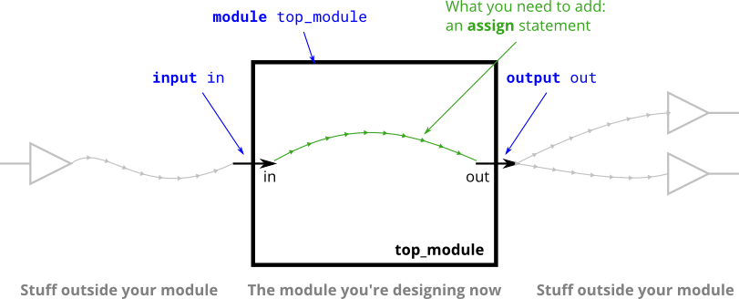

# 003. Simple wire

**Section:** Verilog Language — Basics  
**HDLBits:** [Simple wire](https://hdlbits.01xz.net/wiki/Wire)

## Problem

Create a module with one input `in` and one output `out`.
Connect `out` directly to `in` (a wire).

## Figures (from HDLBits)

Copied from the official HDLBits problem page for this tutorial.



## Solution

The module is named `top_module` so you can paste it into HDLBits. The same source is in [`003_wire.v`](./003_wire.v).

```verilog
module top_module (
    input  in,
    output out
);
    assign out = in;
endmodule
```
