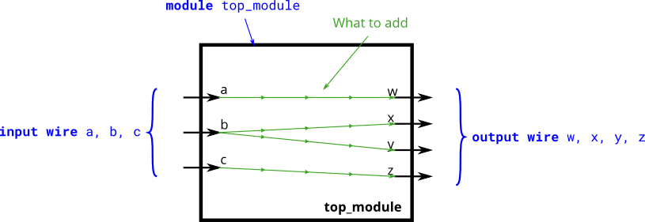

# 004. Four wires

**Section:** Verilog Language — Basics  
**HDLBits:** [Four wires](https://hdlbits.01xz.net/wiki/Wire4)

## Problem

Create a module with three inputs `a`, `b`, `c` and four outputs
`w`, `x`, `y`, `z`. Connect them as follows:
  w = a,  x = b,  y = b,  z = c
(`b` fans out to both `x` and `y`).

## Figures (from HDLBits)

Copied from the official HDLBits problem page for this tutorial.



## Solution

The module is named `top_module` so you can paste it into HDLBits. The same source is in [`004_wire4.v`](./004_wire4.v).

```verilog
module top_module (
    input  a, b, c,
    output w, x, y, z
);
    assign w = a;
    assign x = b;
    assign y = b;
    assign z = c;
endmodule
```
