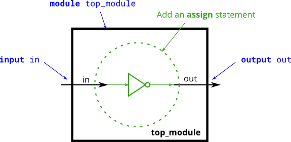

# 005. Inverter

**Section:** Verilog Language — Basics  
**HDLBits:** [Inverter](https://hdlbits.01xz.net/wiki/Notgate)

## Problem

Build a NOT gate: `out` is the inversion of `in`.

## Figures (from HDLBits)

Copied from the official HDLBits problem page for this tutorial.



## Solution

The module is named `top_module` so you can paste it into HDLBits. The same source is in [`005_notgate.v`](./005_notgate.v).

```verilog
module top_module (
    input  in,
    output out
);
    assign out = ~in;
endmodule
```
