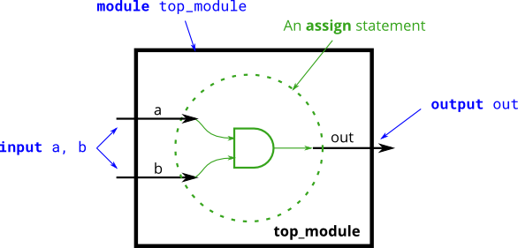

# 006. AND gate

**Section:** Verilog Language — Basics  
**HDLBits:** [AND gate](https://hdlbits.01xz.net/wiki/Andgate)

## Problem

Build a 2-input AND gate: `out = a AND b`.

## Figures (from HDLBits)

Copied from the official HDLBits problem page for this tutorial.



## Solution

The module is named `top_module` so you can paste it into HDLBits. The same source is in [`006_andgate.v`](./006_andgate.v).

```verilog
module top_module (
    input  a,
    input  b,
    output out
);
    assign out = a & b;
endmodule
```
