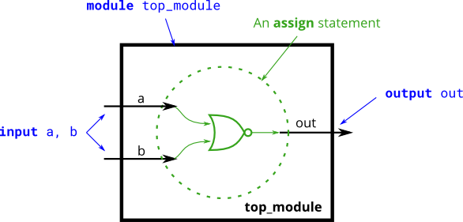

# 007. NOR gate

**Section:** Verilog Language — Basics  
**HDLBits:** [NOR gate](https://hdlbits.01xz.net/wiki/Norgate)

## Problem

Build a 2-input NOR gate: `out = NOT (a OR b)`.

## Figures (from HDLBits)

Copied from the official HDLBits problem page for this tutorial.



## Solution

The module is named `top_module` so you can paste it into HDLBits. The same source is in [`007_norgate.v`](./007_norgate.v).

```verilog
module top_module (
    input  a,
    input  b,
    output out
);
    assign out = ~(a | b);
endmodule
```
