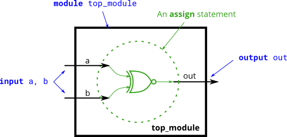

# 008. XNOR gate

**Section:** Verilog Language — Basics  
**HDLBits:** [XNOR gate](https://hdlbits.01xz.net/wiki/Xnorgate)

## Problem

Build a 2-input XNOR (equality) gate: `out` is 1 when `a` and `b`
are the same.

## Figures (from HDLBits)

Copied from the official HDLBits problem page for this tutorial.



## Solution

The module is named `top_module` so you can paste it into HDLBits. The same source is in [`008_xnorgate.v`](./008_xnorgate.v).

```verilog
module top_module (
    input  a,
    input  b,
    output out
);
    assign out = ~(a ^ b);
endmodule
```
