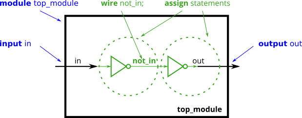
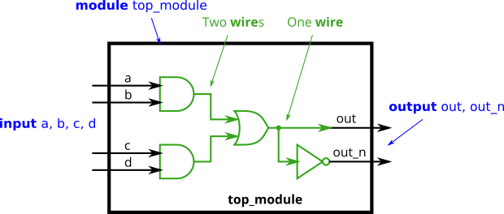

# 009. Declaring wires

**Section:** Verilog Language — Basics  
**HDLBits:** [Declaring wires](https://hdlbits.01xz.net/wiki/Wire_decl)

## Problem

Implement the circuit that computes:
  out   = (a | b) & (c | d)
  out_n = ~out
Declare an internal wire for the AND result rather than repeating
the expression.

## Figures (from HDLBits)

Copied from the official HDLBits problem page for this tutorial.





## Solution

The module is named `top_module` so you can paste it into HDLBits. The same source is in [`009_wire_decl.v`](./009_wire_decl.v).

```verilog
module top_module (
    input  a,
    input  b,
    input  c,
    input  d,
    output out,
    output out_n
);
    wire and_out;
    assign and_out = (a | b) & (c | d);
    assign out     = and_out;
    assign out_n   = ~and_out;
endmodule
```
