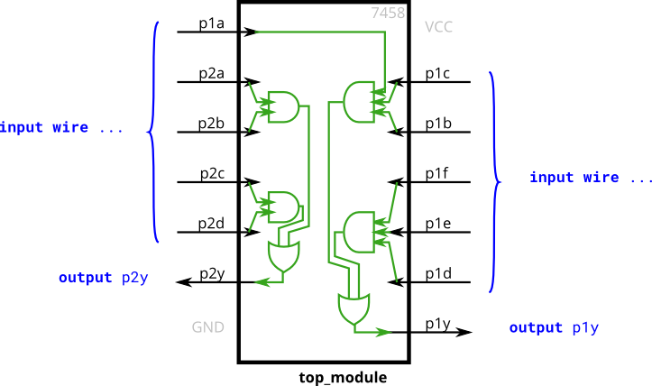

# 010. 7458 chip

**Section:** Verilog Language — Basics  
**HDLBits:** [7458 chip](https://hdlbits.01xz.net/wiki/7458)

## Problem

Implement the 7458 dual AND-OR chip:
  p1y = (p1a & p1b & p1c) | (p1d & p1e & p1f)
  p2y = (p2a & p2b) | (p2c & p2d)
You may introduce internal wires for the AND terms.

## Figures (from HDLBits)

Copied from the official HDLBits problem page for this tutorial.



## Solution

The module is named `top_module` so you can paste it into HDLBits. The same source is in [`010_chip7458.v`](./010_chip7458.v).

```verilog
module top_module (
    input  p1a, p1b, p1c, p1d, p1e, p1f,
    output p1y,
    input  p2a, p2b, p2c, p2d,
    output p2y
);
    wire and1a, and1b, and2a, and2b;
    assign and1a = p1a & p1b & p1c;
    assign and1b = p1d & p1e & p1f;
    assign and2a = p2a & p2b;
    assign and2b = p2c & p2d;
    assign p1y = and1a | and1b;
    assign p2y = and2a | and2b;
endmodule
```
