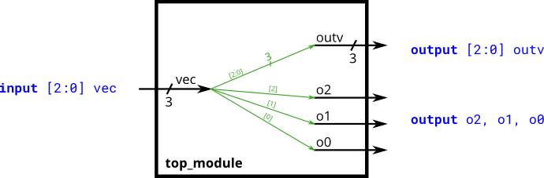

# 011. Vectors

**Section:** Verilog Language — Vectors  
**HDLBits:** [Vectors](https://hdlbits.01xz.net/wiki/Vector0)

## Problem

Input `vec[2:0]` is a 3-bit vector. Drive `outv` with the same
vector, and also split it onto scalar outputs `o2`, `o1`, `o0`
(o2 is the MSB).

## Figures (from HDLBits)

Copied from the official HDLBits problem page for this tutorial.



## Solution

The module is named `top_module` so you can paste it into HDLBits. The same source is in [`011_vector0.v`](./011_vector0.v).

```verilog
module top_module (
    input  wire [2:0] vec,
    output wire [2:0] outv,
    output wire       o2,
    output wire       o1,
    output wire       o0
);
    assign outv = vec;
    assign o2   = vec[2];
    assign o1   = vec[1];
    assign o0   = vec[0];
endmodule
```
