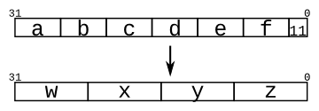

# 016. Vector concatenation operator

**Section:** Verilog Language — Vectors  
**HDLBits:** [Vector concatenation operator](https://hdlbits.01xz.net/wiki/Vector3)

## Problem

Concatenate six 5-bit inputs `{a,b,c,d,e,f}` (30 bits) into four
8-bit outputs `{w,x,y,z}` (32 bits). The extra two bits are `2'b11`
appended on the LSB side:
  {w, x, y, z} = {a, b, c, d, e, f, 2'b11}

## Figures (from HDLBits)

Copied from the official HDLBits problem page for this tutorial.



## Solution

The module is named `top_module` so you can paste it into HDLBits. The same source is in [`016_vector3.v`](./016_vector3.v).

```verilog
module top_module (
    input  [4:0] a, b, c, d, e, f,
    output [7:0] w, x, y, z
);
    assign {w, x, y, z} = {a, b, c, d, e, f, 2'b11};
endmodule
```
