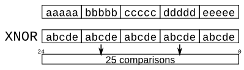

# 019. More replication

**Section:** Verilog Language — Vectors  
**HDLBits:** [More replication](https://hdlbits.01xz.net/wiki/Vector5)

## Problem

Given five inputs a,b,c,d,e, compute a 25-bit output that is the
pairwise XNOR of every pair (including a signal with itself).
One compact form:
  out = ~{ {5{a}}, {5{b}}, {5{c}}, {5{d}}, {5{e}} }
        ^ { 5{a,b,c,d,e} }
Each 5-bit group compares one input against {a,b,c,d,e}.

## Figures (from HDLBits)

Copied from the official HDLBits problem page for this tutorial.



## Solution

The module is named `top_module` so you can paste it into HDLBits. The same source is in [`019_vector5.v`](./019_vector5.v).

```verilog
module top_module (
    input        a, b, c, d, e,
    output [24:0] out
);
    assign out = ~{{5{a}}, {5{b}}, {5{c}}, {5{d}}, {5{e}}} ^ {5{a, b, c, d, e}};
endmodule
```
