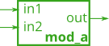
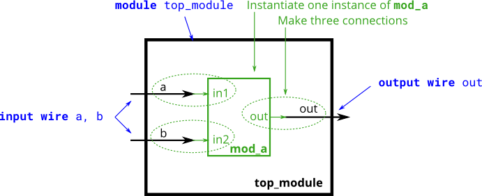

# 020. Modules

**Section:** Verilog Language — Modules: Hierarchy  
**HDLBits:** [Modules](https://hdlbits.01xz.net/wiki/Module)

## Problem

Instantiate the provided module `mod_a` (ports `in1`, `in2`, `out`)
once. Connect `in1` to `a`, `in2` to `b`, and `out` to `out`.
HDLBits supplies `mod_a`; a local helper is in hdlbits/helpers/mod_a.v.

## Figures (from HDLBits)

Copied from the official HDLBits problem page for this tutorial.





## Notes

HDLBits provides `mod_a`. For local simulation compile with `helpers/mod_a.v`.

## Solution

The module is named `top_module` so you can paste it into HDLBits. The same source is in [`020_module.v`](./020_module.v).

```verilog
module top_module (
    input  a,
    input  b,
    output out
);
    mod_a inst (
        .in1(a),
        .in2(b),
        .out(out)
    );
endmodule
```
