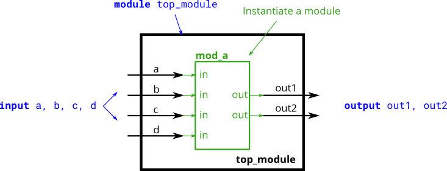

# 021. Connecting ports by position

**Section:** Verilog Language — Modules: Hierarchy  
**HDLBits:** [Connecting ports by position](https://hdlbits.01xz.net/wiki/Module_pos)

## Problem

Instantiate `mod_a` whose ports, in declaration order, are
`out1`, `out2`, `in1`, `in2`, `in3`, `in4`. Connect by position:
  out1->out1, out2->out2, in1->a, in2->b, in3->c, in4->d

## Figures (from HDLBits)

Copied from the official HDLBits problem page for this tutorial.



## Notes

HDLBits provides this `mod_a` (6-port version). Local helper: `helpers/mod_a_6port.v`.

## Solution

The module is named `top_module` so you can paste it into HDLBits. The same source is in [`021_module_pos.v`](./021_module_pos.v).

```verilog
module top_module (
    input  a,
    input  b,
    input  c,
    input  d,
    output out1,
    output out2
);
    mod_a inst (out1, out2, a, b, c, d);
endmodule
```
