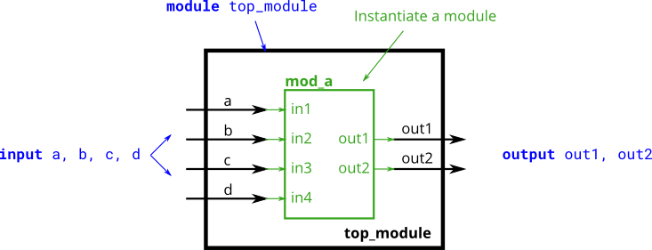

# 022. Connecting ports by name

**Section:** Verilog Language — Modules: Hierarchy  
**HDLBits:** [Connecting ports by name](https://hdlbits.01xz.net/wiki/Module_name)

## Problem

Same `mod_a` as the previous problem, but connect ports by name:
  .out1(out1), .out2(out2), .in1(a), .in2(b), .in3(c), .in4(d)

## Figures (from HDLBits)

Copied from the official HDLBits problem page for this tutorial.



## Notes

Use `helpers/mod_a_6port.v` for local simulation.

## Solution

The module is named `top_module` so you can paste it into HDLBits. The same source is in [`022_module_name.v`](./022_module_name.v).

```verilog
module top_module (
    input  a,
    input  b,
    input  c,
    input  d,
    output out1,
    output out2
);
    mod_a inst (
        .out1(out1),
        .out2(out2),
        .in1(a),
        .in2(b),
        .in3(c),
        .in4(d)
    );
endmodule
```
