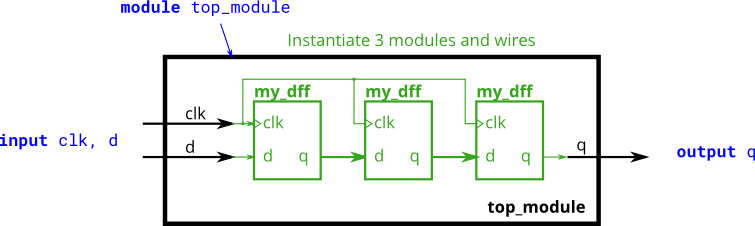

# 023. Three modules

**Section:** Verilog Language — Modules: Hierarchy  
**HDLBits:** [Three modules](https://hdlbits.01xz.net/wiki/Module_shift)

## Problem

You are given `my_dff` (a positive-edge D flip-flop: clk, d, q).
Instantiate three of them in a chain to make a 3-cycle delay:
  d -> dff1 -> dff2 -> dff3 -> q

## Figures (from HDLBits)

Copied from the official HDLBits problem page for this tutorial.



## Notes

HDLBits provides `my_dff`. Local helper: `helpers/my_dff.v`.

## Solution

The module is named `top_module` so you can paste it into HDLBits. The same source is in [`023_module_shift.v`](./023_module_shift.v).

```verilog
module top_module (
    input  clk,
    input  d,
    output q
);
    wire q1, q2;
    my_dff d1 (.clk(clk), .d(d),  .q(q1));
    my_dff d2 (.clk(clk), .d(q1), .q(q2));
    my_dff d3 (.clk(clk), .d(q2), .q(q));
endmodule
```
