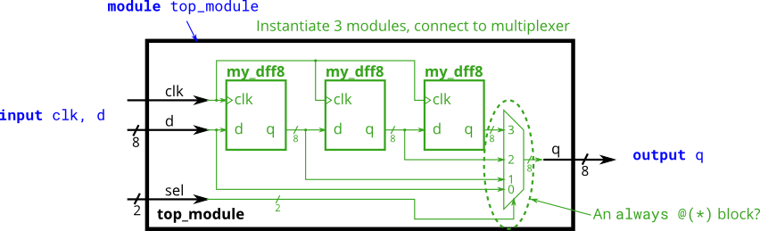

# 024. Modules and vectors

**Section:** Verilog Language — Modules: Hierarchy  
**HDLBits:** [Modules and vectors](https://hdlbits.01xz.net/wiki/Module_shift8)

## Problem

You are given `my_dff8` (8-bit DFF). Build a 4-deep pipeline of
8-bit registers. Input `sel[1:0]` muxes among:
  0: d (0 delay), 1: after 1 DFF, 2: after 2 DFFs, 3: after 3 DFFs.

## Figures (from HDLBits)

Copied from the official HDLBits problem page for this tutorial.



## Notes

HDLBits provides `my_dff8`. Local helper: `helpers/my_dff8.v`.

## Solution

The module is named `top_module` so you can paste it into HDLBits. The same source is in [`024_module_shift8.v`](./024_module_shift8.v).

```verilog
module top_module (
    input        clk,
    input  [7:0] d,
    input  [1:0] sel,
    output reg [7:0] q
);
    wire [7:0] a, b, c;
    my_dff8 d1 (.clk(clk), .d(d), .q(a));
    my_dff8 d2 (.clk(clk), .d(a), .q(b));
    my_dff8 d3 (.clk(clk), .d(b), .q(c));
    always @(*) begin
        case (sel)
            2'd0: q = d;
            2'd1: q = a;
            2'd2: q = b;
            2'd3: q = c;
        endcase
    end
endmodule
```
