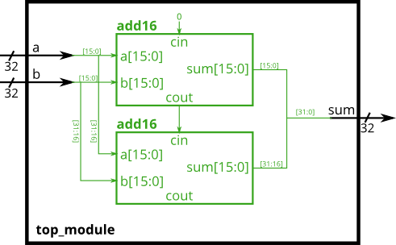

# 025. Adder 1

**Section:** Verilog Language — Modules: Hierarchy  
**HDLBits:** [Adder 1](https://hdlbits.01xz.net/wiki/Module_add)

## Problem

You are given `add16` (16-bit adder with carry in/out). Build a
32-bit adder by instantiating two `add16` modules. The low half
has cin=0; its cout feeds the high half's cin. Ignore the upper cout.

## Figures (from HDLBits)

Copied from the official HDLBits problem page for this tutorial.



## Notes

HDLBits provides `add16`. Local helper: `helpers/add16.v`.

## Solution

The module is named `top_module` so you can paste it into HDLBits. The same source is in [`025_module_add.v`](./025_module_add.v).

```verilog
module top_module (
    input  [31:0] a,
    input  [31:0] b,
    output [31:0] sum
);
    wire cout_lo;
    add16 lo (
        .a(a[15:0]),
        .b(b[15:0]),
        .cin(1'b0),
        .sum(sum[15:0]),
        .cout(cout_lo)
    );
    add16 hi (
        .a(a[31:16]),
        .b(b[31:16]),
        .cin(cout_lo),
        .sum(sum[31:16]),
        .cout()
    );
endmodule
```
