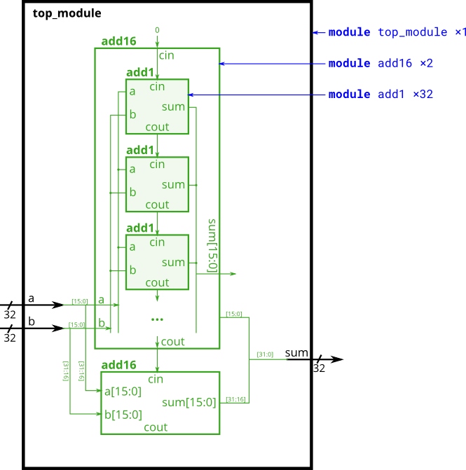

# 026. Adder 2

**Section:** Verilog Language — Modules: Hierarchy  
**HDLBits:** [Adder 2](https://hdlbits.01xz.net/wiki/Module_fadd)

## Problem

Build a 32-bit adder from two provided `add16` modules (same as
Adder 1) and also implement a 1-bit full adder `add1` (a, b, cin
-> sum, cout). HDLBits uses your `add1` inside its `add16`.

## Figures (from HDLBits)

Copied from the official HDLBits problem page for this tutorial.



## Notes

HDLBits provides `add16` and asks you to write `add1`. Local helper: `helpers/add16.v`.

## Solution

The module is named `top_module` so you can paste it into HDLBits. The same source is in [`026_module_fadd.v`](./026_module_fadd.v).

```verilog
module top_module (
    input  [31:0] a,
    input  [31:0] b,
    output [31:0] sum
);
    wire cout_lo;
    add16 lo (
        .a(a[15:0]),
        .b(b[15:0]),
        .cin(1'b0),
        .sum(sum[15:0]),
        .cout(cout_lo)
    );
    add16 hi (
        .a(a[31:16]),
        .b(b[31:16]),
        .cin(cout_lo),
        .sum(sum[31:16]),
        .cout()
    );
endmodule

module add1 (
    input  a,
    input  b,
    input  cin,
    output sum,
    output cout
);
    assign sum  = a ^ b ^ cin;
    assign cout = (a & b) | (a & cin) | (b & cin);
endmodule
```
