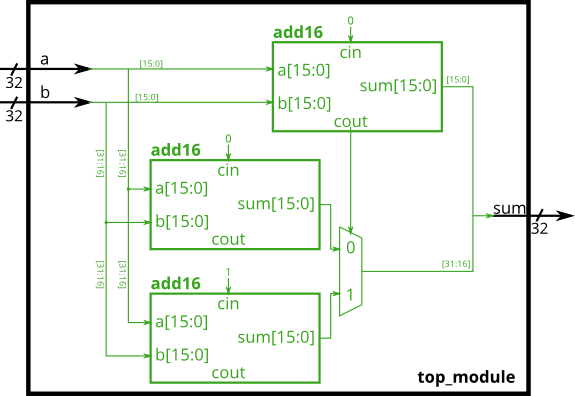

# 027. Carry-select adder

**Section:** Verilog Language — Modules: Hierarchy  
**HDLBits:** [Carry-select adder](https://hdlbits.01xz.net/wiki/Module_cseladd)

## Problem

Build a 32-bit carry-select adder from three `add16` instances:
  - add the lower 16 bits (cin=0) to get sum[15:0] and a carry
  - add the upper 16 bits twice, once with cin=0 and once with cin=1
  - mux the two upper sums using the lower carry

## Figures (from HDLBits)

Copied from the official HDLBits problem page for this tutorial.



## Notes

HDLBits provides `add16`. Local helper: `helpers/add16.v`.

## Solution

The module is named `top_module` so you can paste it into HDLBits. The same source is in [`027_module_cseladd.v`](./027_module_cseladd.v).

```verilog
module top_module (
    input  [31:0] a,
    input  [31:0] b,
    output [31:0] sum
);
    wire        cout_lo;
    wire [15:0] sum_cin0, sum_cin1;
    add16 lo (
        .a(a[15:0]), .b(b[15:0]), .cin(1'b0),
        .sum(sum[15:0]), .cout(cout_lo)
    );
    add16 hi0 (
        .a(a[31:16]), .b(b[31:16]), .cin(1'b0),
        .sum(sum_cin0), .cout()
    );
    add16 hi1 (
        .a(a[31:16]), .b(b[31:16]), .cin(1'b1),
        .sum(sum_cin1), .cout()
    );
    assign sum[31:16] = cout_lo ? sum_cin1 : sum_cin0;
endmodule
```
