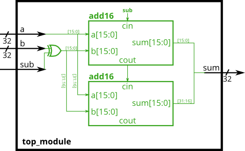
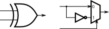

# 028. Adder-subtractor

**Section:** Verilog Language — Modules: Hierarchy  
**HDLBits:** [Adder-subtractor](https://hdlbits.01xz.net/wiki/Module_addsub)

## Problem

Build a 32-bit adder-subtractor using two `add16` modules.
When `sub` is 0, compute a+b. When `sub` is 1, compute a-b by
inverting `b` and setting the low-half carry-in to 1 (two's complement).

## Figures (from HDLBits)

Copied from the official HDLBits problem page for this tutorial.





## Notes

HDLBits provides `add16`. Local helper: `helpers/add16.v`.

## Solution

The module is named `top_module` so you can paste it into HDLBits. The same source is in [`028_module_addsub.v`](./028_module_addsub.v).

```verilog
module top_module (
    input         sub,
    input  [31:0] a,
    input  [31:0] b,
    output [31:0] sum
);
    wire [31:0] b_xor;
    wire        cout_lo;
    assign b_xor = b ^ {32{sub}};
    add16 lo (
        .a(a[15:0]), .b(b_xor[15:0]), .cin(sub),
        .sum(sum[15:0]), .cout(cout_lo)
    );
    add16 hi (
        .a(a[31:16]), .b(b_xor[31:16]), .cin(cout_lo),
        .sum(sum[31:16]), .cout()
    );
endmodule
```
