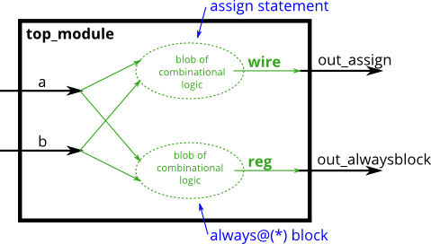

# 029. Always blocks (combinational)

**Section:** Verilog Language — Procedures  
**HDLBits:** [Always blocks (combinational)](https://hdlbits.01xz.net/wiki/Alwaysblock1)

## Problem

Build a 2-input AND gate twice: once with a continuous assignment
(`out_assign`) and once with a combinational `always` block
(`out_alwaysblock`). Both must compute a AND b.

## Figures (from HDLBits)

Copied from the official HDLBits problem page for this tutorial.



## Solution

The module is named `top_module` so you can paste it into HDLBits. The same source is in [`029_alwaysblock1.v`](./029_alwaysblock1.v).

```verilog
module top_module (
    input  a,
    input  b,
    output     out_assign,
    output reg out_alwaysblock
);
    assign out_assign = a & b;
    always @(*) begin
        out_alwaysblock = a & b;
    end
endmodule
```
