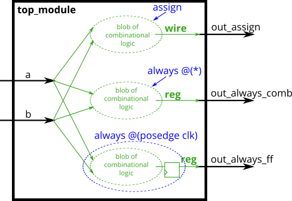

# 030. Always blocks (clocked)

**Section:** Verilog Language — Procedures  
**HDLBits:** [Always blocks (clocked)](https://hdlbits.01xz.net/wiki/Alwaysblock2)

## Problem

Build an XOR three ways:
  out_assign       — continuous assignment (combinational)
  out_alwayscomb   — combinational always block (blocking `=`)
  out_alwaysff     — clocked always block, XOR registered on
                     posedge clk (non-blocking `<=`)

## Figures (from HDLBits)

Copied from the official HDLBits problem page for this tutorial.



## Solution

The module is named `top_module` so you can paste it into HDLBits. The same source is in [`030_alwaysblock2.v`](./030_alwaysblock2.v).

```verilog
module top_module (
    input      clk,
    input      a,
    input      b,
    output     out_assign,
    output reg out_always_comb,
    output reg out_always_ff
);
    assign out_assign = a ^ b;
    always @(*) begin
        out_always_comb = a ^ b;
    end
    always @(posedge clk) begin
        out_always_ff <= a ^ b;
    end
endmodule
```
