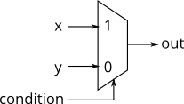

# 031. If statement

**Section:** Verilog Language — Procedures  
**HDLBits:** [If statement](https://hdlbits.01xz.net/wiki/Always_if)

## Problem

A 2-to-1 mux selects between two AND-like results:
  If `sel_b1` and `sel_b2` are both 1, choose `b`; otherwise choose `a`.
Implement this with an `assign` (out_assign) and with an always-if
(out_always).

## Figures (from HDLBits)

Copied from the official HDLBits problem page for this tutorial.



## Solution

The module is named `top_module` so you can paste it into HDLBits. The same source is in [`031_always_if.v`](./031_always_if.v).

```verilog
module top_module (
    input      a,
    input      b,
    input      sel_b1,
    input      sel_b2,
    output     out_assign,
    output reg out_always
);
    assign out_assign = (sel_b1 & sel_b2) ? b : a;
    always @(*) begin
        if (sel_b1 & sel_b2)
            out_always = b;
        else
            out_always = a;
    end
endmodule
```
