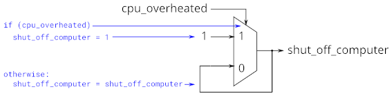

# 032. If statement latches

**Section:** Verilog Language — Procedures  
**HDLBits:** [If statement latches](https://hdlbits.01xz.net/wiki/Always_if2)

## Problem

Fix a combinational always block that accidentally infers a latch
because `out` is not assigned in every branch. The intended function
is a mux: if `cpu_overheated` then `shut_off_computer = 1` else 0;
if `arrived` then `keep_driving = ~gas_tank_empty` else 0.
Always assign both outputs in all cases.

## Figures (from HDLBits)

Copied from the official HDLBits problem page for this tutorial.



## Solution

The module is named `top_module` so you can paste it into HDLBits. The same source is in [`032_always_if2.v`](./032_always_if2.v).

```verilog
module top_module (
    input      cpu_overheated,
    output reg shut_off_computer,
    input      arrived,
    input      gas_tank_empty,
    output reg keep_driving
);
    always @(*) begin
        if (cpu_overheated)
            shut_off_computer = 1'b1;
        else
            shut_off_computer = 1'b0;
    end

    always @(*) begin
        if (~arrived)
            keep_driving = ~gas_tank_empty;
        else
            keep_driving = 1'b0;
    end
endmodule
```
