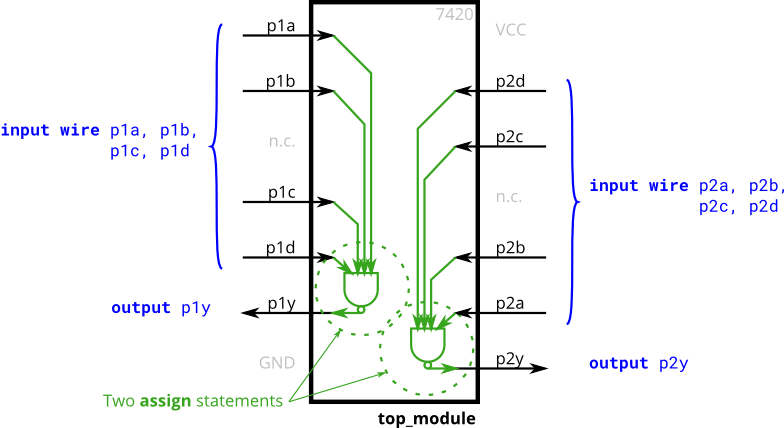

# 050. 7420 chip

**Section:** Circuits — Combinational Logic — Basic Gates  
**HDLBits:** [7420 chip](https://hdlbits.01xz.net/wiki/7420)

## Problem

The 7420 is two independent 4-input NAND gates:
  p1y = NAND(p1a,p1b,p1c,p1d)
  p2y = NAND(p2a,p2b,p2c,p2d)

## Figures (from HDLBits)

Copied from the official HDLBits problem page for this tutorial.



## Solution

The module is named `top_module` so you can paste it into HDLBits. The same source is in [`050_chip7420.v`](./050_chip7420.v).

```verilog
module top_module (
    input  p1a, p1b, p1c, p1d,
    output p1y,
    input  p2a, p2b, p2c, p2d,
    output p2y
);
    assign p1y = ~(p1a & p1b & p1c & p1d);
    assign p2y = ~(p2a & p2b & p2c & p2d);
endmodule
```
