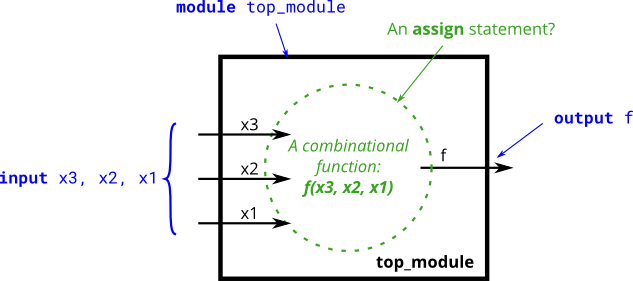

# 051. Truth tables

**Section:** Circuits — Combinational Logic — Basic Gates  
**HDLBits:** [Truth tables](https://hdlbits.01xz.net/wiki/Truthtable1)

## Problem

Implement the 3-input function f(x3,x2,x1) whose 1-minterms are
2, 3, 5 and 7 (binary 010, 011, 101, 111).
Simplified: f = (~x3 & x2) | (x3 & x1)

## Figures (from HDLBits)

Copied from the official HDLBits problem page for this tutorial.



## Solution

The module is named `top_module` so you can paste it into HDLBits. The same source is in [`051_truthtable1.v`](./051_truthtable1.v).

```verilog
module top_module (
    input  x3,
    input  x2,
    input  x1,
    output f
);
    assign f = (~x3 & x2) | (x3 & x1);
endmodule
```
