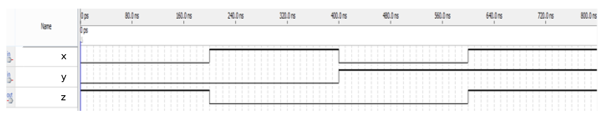

# 054. Simple circuit B

**Section:** Circuits — Combinational Logic — Basic Gates  
**HDLBits:** [Simple circuit B](https://hdlbits.01xz.net/wiki/Mt2015_q4b)

## Problem

Circuit B is an XNOR of x and y: z = ~(x ^ y).

## Figures (from HDLBits)

Copied from the official HDLBits problem page for this tutorial.



## Solution

The module is named `top_module` so you can paste it into HDLBits. The same source is in [`054_mt2015_q4b.v`](./054_mt2015_q4b.v).

```verilog
module top_module (
    input  x,
    input  y,
    output z
);
    assign z = ~(x ^ y);
endmodule
```
