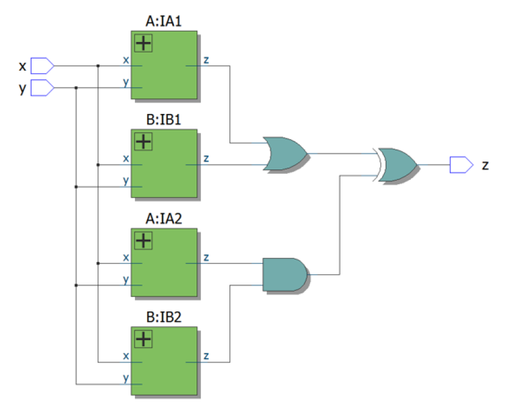

# 055. Combine circuits A and B

**Section:** Circuits — Combinational Logic — Basic Gates  
**HDLBits:** [Combine circuits A and B](https://hdlbits.01xz.net/wiki/Mt2015_q4)

## Problem

Instantiate two copies of circuit A and two of circuit B, all driven
by (x, y). Combine them as:
  z = (A1 | B1) ^ (A2 & B2)
Write A and B as submodules in the same file.

## Figures (from HDLBits)

Copied from the official HDLBits problem page for this tutorial.



## Solution

The module is named `top_module` so you can paste it into HDLBits. The same source is in [`055_mt2015_q4.v`](./055_mt2015_q4.v).

```verilog
module top_module (
    input  x,
    input  y,
    output z
);
    wire a1, b1, a2, b2;
    mt2015_q4_a ua1 (.x(x), .y(y), .z(a1));
    mt2015_q4_b ub1 (.x(x), .y(y), .z(b1));
    mt2015_q4_a ua2 (.x(x), .y(y), .z(a2));
    mt2015_q4_b ub2 (.x(x), .y(y), .z(b2));
    assign z = (a1 | b1) ^ (a2 & b2);
endmodule

module mt2015_q4_a (
    input  x,
    input  y,
    output z
);
    assign z = (x ^ y) & x;
endmodule

module mt2015_q4_b (
    input  x,
    input  y,
    output z
);
    assign z = ~(x ^ y);
endmodule
```
