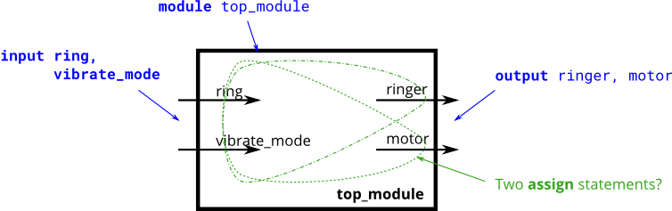

# 056. Ring or vibrate?

**Section:** Circuits — Combinational Logic — Basic Gates  
**HDLBits:** [Ring or vibrate?](https://hdlbits.01xz.net/wiki/Ringer)

## Problem

Phone ringer/vibrator:
  ringer = ring & ~vibrate_mode
  motor  = ring &  vibrate_mode
Exactly one of ringer/motor is on when `ring` is 1, selected by mode.

## Figures (from HDLBits)

Copied from the official HDLBits problem page for this tutorial.



## Solution

The module is named `top_module` so you can paste it into HDLBits. The same source is in [`056_ringer.v`](./056_ringer.v).

```verilog
module top_module (
    input  ring,
    input  vibrate_mode,
    output ringer,
    output motor
);
    assign ringer = ring & ~vibrate_mode;
    assign motor  = ring &  vibrate_mode;
endmodule
```
