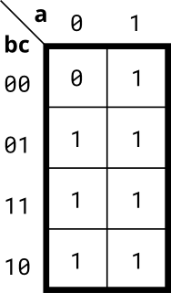

# 073. 3-variable

**Section:** Circuits — Combinational Logic — Karnaugh Map to Circuit  
**HDLBits:** [3-variable](https://hdlbits.01xz.net/wiki/Kmap1)

## Problem

Implement the 3-variable K-map (a across the top, bc down the side):

          a=0   a=1
    bc=00  0     1
    bc=01  1     1
    bc=11  1     1
    bc=10  1     1

Only minterm 000 is 0, so out = a | b | c.

## Figures (from HDLBits)

Copied from the official HDLBits problem page for this tutorial.



## Solution

The module is named `top_module` so you can paste it into HDLBits. The same source is in [`073_kmap1.v`](./073_kmap1.v).

```verilog
module top_module (
    input  a, b, c,
    output out
);
    assign out = a | b | c;
endmodule
```
