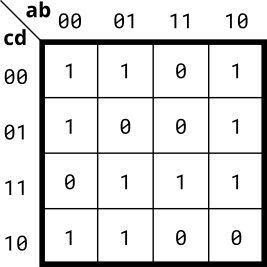

# 074. 4-variable

**Section:** Circuits — Combinational Logic — Karnaugh Map to Circuit  
**HDLBits:** [4-variable](https://hdlbits.01xz.net/wiki/Kmap2)

## Problem

4-variable K-map (ab rows, cd columns):

           cd=00  01  11  10
    ab=00    0     1   1   1
    ab=01    0     0   0   0
    ab=11    1     1   1   1
    ab=10    1     1   0   1

One SOP covering:
  out = (~a & ~b & (c | d)) | (a & b) | (a & ~b & ~(c & d))

## Figures (from HDLBits)

Copied from the official HDLBits problem page for this tutorial.



## Solution

The module is named `top_module` so you can paste it into HDLBits. The same source is in [`074_kmap2.v`](./074_kmap2.v).

```verilog
module top_module (
    input  a, b, c, d,
    output out
);
    assign out = (~a & ~b & (c | d))
               | (a & b)
               | (a & ~b & ~(c & d));
endmodule
```
