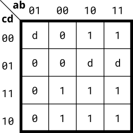

# 075. 4-variable (don't-cares)

**Section:** Circuits — Combinational Logic — Karnaugh Map to Circuit  
**HDLBits:** [4-variable (don't-cares)](https://hdlbits.01xz.net/wiki/Kmap3)

## Problem

4-variable K-map with don't-cares. One covering that matches the
official map (don't-cares taken as 1 only where they help, never
covering a required 0) is:

  out = a ? (c | d) : (~b & c)

Compare the K-map image on HDLBits if you regroup.

## Figures (from HDLBits)

Copied from the official HDLBits problem page for this tutorial.



## Solution

The module is named `top_module` so you can paste it into HDLBits. The same source is in [`075_kmap3.v`](./075_kmap3.v).

```verilog
module top_module (
    input  a, b, c, d,
    output out
);
    assign out = a ? (c | d) : (~b & c);
endmodule
```
