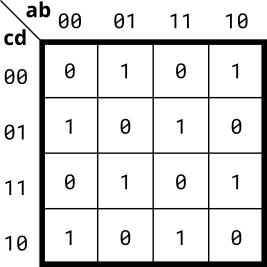

# 076. 4-variable (XOR of all)

**Section:** Circuits — Combinational Logic — Karnaugh Map to Circuit  
**HDLBits:** [4-variable (XOR of all)](https://hdlbits.01xz.net/wiki/Kmap4)

## Problem

The K-map is a checkerboard: flipping any one input always inverts
the output. That function is XOR of all four variables
(odd parity): out = a ^ b ^ c ^ d.

## Figures (from HDLBits)

Copied from the official HDLBits problem page for this tutorial.



## Solution

The module is named `top_module` so you can paste it into HDLBits. The same source is in [`076_kmap4.v`](./076_kmap4.v).

```verilog
module top_module (
    input  a, b, c, d,
    output out
);
    assign out = a ^ b ^ c ^ d;
endmodule
```
