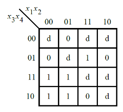

# 078. Karnaugh map

**Section:** Circuits — Combinational Logic — Karnaugh Map to Circuit  
**HDLBits:** [Karnaugh map](https://hdlbits.01xz.net/wiki/Exams/m2014_q3)

## Problem

Implement f(x[4:1]) from the exam K-map. A standard simplified form is:
  f = (~x[1] & x[3]) | (x[2] & x[3] & x[4]) | (~x[2] & ~x[4])
Check the official figure if you want to regroup; any equivalent
Boolean function is accepted.

## Figures (from HDLBits)

Copied from the official HDLBits problem page for this tutorial.



## Solution

The module is named `top_module` so you can paste it into HDLBits. The same source is in [`078_m2014_q3.v`](./078_m2014_q3.v).

```verilog
module top_module (
    input  [4:1] x,
    output       f
);
    assign f = (~x[1] & x[3])
             | (x[2] & x[3] & x[4])
             | (~x[2] & ~x[4]);
endmodule
```
