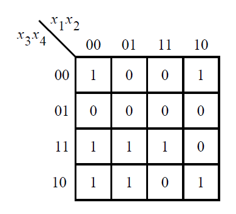

# 079. Karnaugh map

**Section:** Circuits — Combinational Logic — Karnaugh Map to Circuit  
**HDLBits:** [Karnaugh map](https://hdlbits.01xz.net/wiki/Exams/2012_q1g)

## Problem

Another exam K-map on x[4:1]. A common simplified SOP:
  f = (~x[2] & ~x[4]) | (~x[1] & x[3]) | (x[2] & x[3] & x[4])
This is similar to m2014_q3 with a different covering of the 1s.

## Figures (from HDLBits)

Copied from the official HDLBits problem page for this tutorial.



## Solution

The module is named `top_module` so you can paste it into HDLBits. The same source is in [`079_2012_q1g.v`](./079_2012_q1g.v).

```verilog
module top_module (
    input  [4:1] x,
    output       f
);
    assign f = (~x[2] & ~x[4])
             | (~x[1] & x[3])
             | (x[2] & x[3] & x[4]);
endmodule
```
