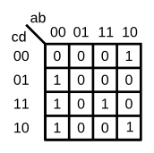

# 080. K-map implemented with a multiplexer

**Section:** Circuits — Combinational Logic — Karnaugh Map to Circuit  
**HDLBits:** [K-map implemented with a multiplexer](https://hdlbits.01xz.net/wiki/Exams/ece241_2014_q3)

## Problem

Implement the K-map using a 4:1 mux whose select is {a,b} (given
as part of the top-level on HDLBits — you only drive mux_in[3:0],
the four data inputs of the mux, as functions of c and d).

One accepted programming of the mux data inputs:
  mux_in[0] = c | d      // ab=00
  mux_in[1] = 1'b0       // ab=01
  mux_in[2] = ~d         // ab=11
  mux_in[3] = c & d      // ab=10
(Gray-code order of ab: 00, 01, 11, 10 corresponding to mux_in 0,1,2,3
on some figures — HDLBits numbers mux_in[0] for ab=00, [1] for 01,
[2] for 11, [3] for 10.)

## Figures (from HDLBits)

Copied from the official HDLBits problem page for this tutorial.




## Solution

The module is named `top_module` so you can paste it into HDLBits. The same source is in [`080_ece241_2014_q3.v`](./080_ece241_2014_q3.v).

```verilog
module top_module (
    input        c,
    input        d,
    output [3:0] mux_in
);
    assign mux_in[0] = c | d;
    assign mux_in[1] = 1'b0;
    assign mux_in[2] = ~d;
    assign mux_in[3] = c & d;
endmodule
```
