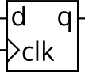

# 081. D flip-flop

**Section:** Circuits — Sequential Logic — Latches and Flip-Flops  
**HDLBits:** [D flip-flop](https://hdlbits.01xz.net/wiki/Dff)

## Problem

Positive-edge D flip-flop: q <= d on posedge clk.

## Figures (from HDLBits)

Copied from the official HDLBits problem page for this tutorial.



## Solution

The module is named `top_module` so you can paste it into HDLBits. The same source is in [`081_dff.v`](./081_dff.v).

```verilog
module top_module (
    input      clk,
    input      d,
    output reg q
);
    always @(posedge clk)
        q <= d;
endmodule
```
