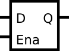

# 087. D Latch

**Section:** Circuits — Sequential Logic — Latches and Flip-Flops  
**HDLBits:** [D Latch](https://hdlbits.01xz.net/wiki/Exams/m2014_q4a)

## Problem

Level-sensitive D latch: when `ena` is 1, q follows d; otherwise q holds.

## Figures (from HDLBits)

Copied from the official HDLBits problem page for this tutorial.



## Solution

The module is named `top_module` so you can paste it into HDLBits. The same source is in [`087_m2014_q4a.v`](./087_m2014_q4a.v).

```verilog
module top_module (
    input      d,
    input      ena,
    output reg q
);
    always @(*) begin
        if (ena)
            q = d;
    end
endmodule
```
