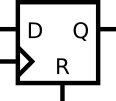

# 089. DFF

**Section:** Circuits — Sequential Logic — Latches and Flip-Flops  
**HDLBits:** [DFF](https://hdlbits.01xz.net/wiki/Exams/m2014_q4c)

## Problem

Positive-edge DFF with active-high *synchronous* reset to 0.

## Figures (from HDLBits)

Copied from the official HDLBits problem page for this tutorial.



## Solution

The module is named `top_module` so you can paste it into HDLBits. The same source is in [`089_m2014_q4c.v`](./089_m2014_q4c.v).

```verilog
module top_module (
    input      clk,
    input      d,
    input      r,
    output reg q
);
    always @(posedge clk) begin
        if (r)
            q <= 1'b0;
        else
            q <= d;
    end
endmodule
```
