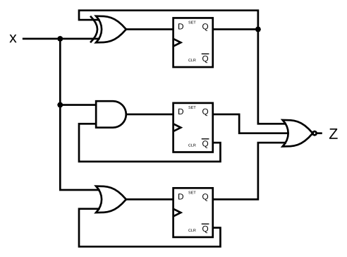

# 093. DFFs and gates

**Section:** Circuits — Sequential Logic — Latches and Flip-Flops  
**HDLBits:** [DFFs and gates](https://hdlbits.01xz.net/wiki/Exams/ece241_2014_q4)

## Problem

Three DFFs with combinational feedback from input x:
  q0 <= q0 ^ x
  q1 <= ~q1 & x
  q2 <= ~q2 | x
Output z is NOR of the three Qs: z = ~(q0 | q1 | q2)
No explicit reset; they start at X in simulation unless you care.
HDLBits typically does not reset them (or they come up 0 in the tester).

## Figures (from HDLBits)

Copied from the official HDLBits problem page for this tutorial.



## Solution

The module is named `top_module` so you can paste it into HDLBits. The same source is in [`093_ece241_2014_q4.v`](./093_ece241_2014_q4.v).

```verilog
module top_module (
    input      clk,
    input      x,
    output     z
);
    reg q0, q1, q2;
    always @(posedge clk) begin
        q0 <= q0 ^ x;
        q1 <= ~q1 & x;
        q2 <= ~q2 | x;
    end
    assign z = ~(q0 | q1 | q2);
endmodule
```
