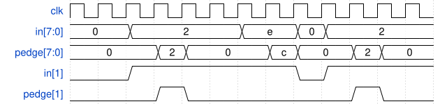

# 095. Detect an edge

**Section:** Circuits — Sequential Logic — Latches and Flip-Flops  
**HDLBits:** [Detect an edge](https://hdlbits.01xz.net/wiki/Edgedetect)

## Problem

For each bit of a 8-bit vector, pulse `pedge` for one cycle when that
bit has a 0->1 transition.

## Figures (from HDLBits)

Copied from the official HDLBits problem page for this tutorial.



## Solution

The module is named `top_module` so you can paste it into HDLBits. The same source is in [`095_edgedetect.v`](./095_edgedetect.v).

```verilog
module top_module (
    input            clk,
    input      [7:0] in,
    output reg [7:0] pedge
);
    reg [7:0] in_d;
    always @(posedge clk) begin
        in_d  <= in;
        pedge <= in & ~in_d;
    end
endmodule
```
