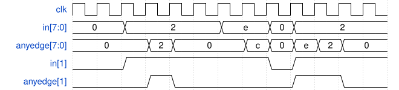

# 096. Detect both edges

**Section:** Circuits — Sequential Logic — Latches and Flip-Flops  
**HDLBits:** [Detect both edges](https://hdlbits.01xz.net/wiki/Edgedetect2)

## Problem

Pulse `anyedge` for one cycle on any 0->1 or 1->0 transition (8 bits).

## Figures (from HDLBits)

Copied from the official HDLBits problem page for this tutorial.



## Solution

The module is named `top_module` so you can paste it into HDLBits. The same source is in [`096_edgedetect2.v`](./096_edgedetect2.v).

```verilog
module top_module (
    input            clk,
    input      [7:0] in,
    output reg [7:0] anyedge
);
    reg [7:0] in_d;
    always @(posedge clk) begin
        in_d    <= in;
        anyedge <= in ^ in_d;
    end
endmodule
```
