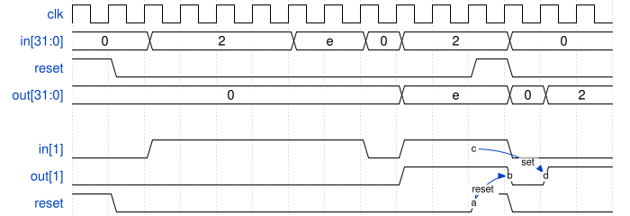

# 097. Edge capture register

**Section:** Circuits — Sequential Logic — Latches and Flip-Flops  
**HDLBits:** [Edge capture register](https://hdlbits.01xz.net/wiki/Edgecapture)

## Problem

32-bit register. For each bit, set the output bit when that input bit
has a 1->0 transition, and hold it until a synchronous reset.
Reset is active-high and takes priority.

## Figures (from HDLBits)

Copied from the official HDLBits problem page for this tutorial.



## Solution

The module is named `top_module` so you can paste it into HDLBits. The same source is in [`097_edgecapture.v`](./097_edgecapture.v).

```verilog
module top_module (
    input             clk,
    input             reset,
    input      [31:0] in,
    output reg [31:0] out
);
    reg [31:0] in_d;
    always @(posedge clk) begin
        in_d <= in;
        if (reset)
            out <= 32'd0;
        else
            out <= out | (~in & in_d);
    end
endmodule
```
