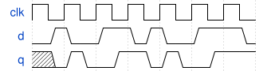

# 098. Dual-edge triggered flip-flop

**Section:** Circuits — Sequential Logic — Latches and Flip-Flops  
**HDLBits:** [Dual-edge triggered flip-flop](https://hdlbits.01xz.net/wiki/Dualedge)

## Problem

A flip-flop that samples `d` on both rising and falling edges of clk.
Implement with two DFFs (posedge and negedge) and XOR/mux them:
  q = clk ? q_neg : q_pos   (one accepted form)
or q = q_pos ^ q_neg with carefully chosen next-state equations.
The mux form: posedge register samples d, negedge register samples d,
output is clk ? n : p so the most recently sampled value is seen.

## Figures (from HDLBits)

Copied from the official HDLBits problem page for this tutorial.



## Solution

The module is named `top_module` so you can paste it into HDLBits. The same source is in [`098_dualedge.v`](./098_dualedge.v).

```verilog
module top_module (
    input      clk,
    input      d,
    output     q
);
    reg p, n;
    always @(posedge clk)
        p <= d;
    always @(negedge clk)
        n <= d;
    assign q = clk ? p : n;
endmodule
```
