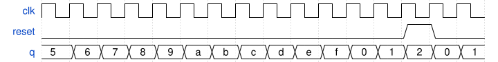

# 099. Four-bit binary counter

**Section:** Circuits — Sequential Logic — Counters  
**HDLBits:** [Four-bit binary counter](https://hdlbits.01xz.net/wiki/Count15)

## Problem

4-bit counter, wraps 0..15. Synchronous reset to 0.

## Figures (from HDLBits)

Copied from the official HDLBits problem page for this tutorial.



## Solution

The module is named `top_module` so you can paste it into HDLBits. The same source is in [`099_count15.v`](./099_count15.v).

```verilog
module top_module (
    input            clk,
    input            reset,
    output reg [3:0] q
);
    always @(posedge clk) begin
        if (reset)
            q <= 4'd0;
        else
            q <= q + 4'd1;
    end
endmodule
```
