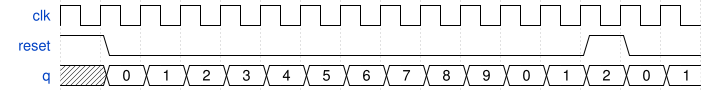

# 100. Decade counter

**Section:** Circuits — Sequential Logic — Counters  
**HDLBits:** [Decade counter](https://hdlbits.01xz.net/wiki/Count10)

## Problem

Count 0 through 9, then wrap to 0. Synchronous reset to 0.

## Figures (from HDLBits)

Copied from the official HDLBits problem page for this tutorial.



## Solution

The module is named `top_module` so you can paste it into HDLBits. The same source is in [`100_count10.v`](./100_count10.v).

```verilog
module top_module (
    input            clk,
    input            reset,
    output reg [3:0] q
);
    always @(posedge clk) begin
        if (reset || q == 4'd9)
            q <= 4'd0;
        else
            q <= q + 4'd1;
    end
endmodule
```
