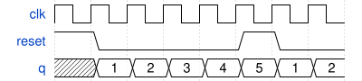

# 101. Decade counter again

**Section:** Circuits — Sequential Logic — Counters  
**HDLBits:** [Decade counter again](https://hdlbits.01xz.net/wiki/Count1to10)

## Problem

Count 1 through 10, then wrap to 1. Synchronous reset to 1.

## Figures (from HDLBits)

Copied from the official HDLBits problem page for this tutorial.



## Solution

The module is named `top_module` so you can paste it into HDLBits. The same source is in [`101_count1to10.v`](./101_count1to10.v).

```verilog
module top_module (
    input            clk,
    input            reset,
    output reg [3:0] q
);
    always @(posedge clk) begin
        if (reset || q == 4'd10)
            q <= 4'd1;
        else
            q <= q + 4'd1;
    end
endmodule
```
