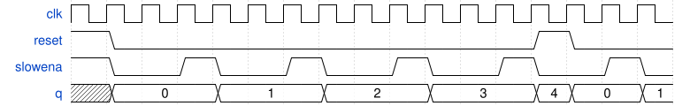

# 102. Slow decade counter

**Section:** Circuits — Sequential Logic — Counters  
**HDLBits:** [Slow decade counter](https://hdlbits.01xz.net/wiki/Countslow)

## Problem

Decade counter (0-9) that only increments when `slowena` is 1.
Synchronous reset to 0.

## Figures (from HDLBits)

Copied from the official HDLBits problem page for this tutorial.



## Solution

The module is named `top_module` so you can paste it into HDLBits. The same source is in [`102_countslow.v`](./102_countslow.v).

```verilog
module top_module (
    input            clk,
    input            slowena,
    input            reset,
    output reg [3:0] q
);
    always @(posedge clk) begin
        if (reset)
            q <= 4'd0;
        else if (slowena) begin
            if (q == 4'd9)
                q <= 4'd0;
            else
                q <= q + 4'd1;
        end
    end
endmodule
```
