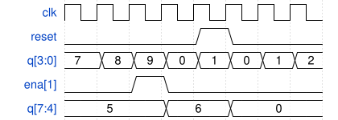

# 105. 4-digit decimal counter

**Section:** Circuits — Sequential Logic — Counters  
**HDLBits:** [4-digit decimal counter](https://hdlbits.01xz.net/wiki/Countbcd)

## Problem

4-digit BCD counter (0 to 9999) with one enable. Each digit is 4 bits
packed into q[15:0] (ones in [3:0]). `ena[3:1]` indicates when digits
1, 2, 3 should increment (ones digit always counts).
Synchronous reset to 0.

## Figures (from HDLBits)

Copied from the official HDLBits problem page for this tutorial.



## Solution

The module is named `top_module` so you can paste it into HDLBits. The same source is in [`105_countbcd.v`](./105_countbcd.v).

```verilog
module top_module (
    input            clk,
    input            reset,
    output [3:1]     ena,
    output reg [15:0] q
);
    assign ena[1] = (q[3:0]   == 4'd9);
    assign ena[2] = ena[1] && (q[7:4]   == 4'd9);
    assign ena[3] = ena[2] && (q[11:8]  == 4'd9);

    always @(posedge clk) begin
        if (reset)
            q <= 16'd0;
        else begin
            q[3:0] <= (q[3:0] == 4'd9) ? 4'd0 : q[3:0] + 4'd1;
            if (ena[1])
                q[7:4] <= (q[7:4] == 4'd9) ? 4'd0 : q[7:4] + 4'd1;
            if (ena[2])
                q[11:8] <= (q[11:8] == 4'd9) ? 4'd0 : q[11:8] + 4'd1;
            if (ena[3])
                q[15:12] <= (q[15:12] == 4'd9) ? 4'd0 : q[15:12] + 4'd1;
        end
    end
endmodule
```
