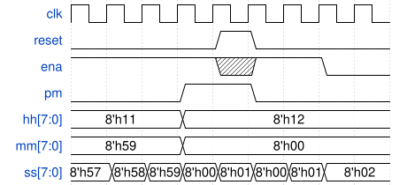

# 106. 12-hour clock

**Section:** Circuits — Sequential Logic — Counters  
**HDLBits:** [12-hour clock](https://hdlbits.01xz.net/wiki/Count_clock)

## Problem

12-hour clock: hours (1-12, BCD in hh[7:0]), minutes (00-59, mm[7:0]),
seconds (00-59, ss[7:0]), plus AM/PM (`pm`).
Synchronous reset sets 12:00:00 AM.
`ena` enables counting. Increment seconds, then minutes, then hours.
After 11:59:59 AM comes 12:00:00 PM, after 11:59:59 PM comes 12:00:00 AM.
After 12:59:59 the hour becomes 1 (same am/pm).

## Figures (from HDLBits)

Copied from the official HDLBits problem page for this tutorial.



## Solution

The module is named `top_module` so you can paste it into HDLBits. The same source is in [`106_count_clock.v`](./106_count_clock.v).

```verilog
module top_module (
    input            clk,
    input            reset,
    input            ena,
    output reg       pm,
    output reg [7:0] hh,
    output reg [7:0] mm,
    output reg [7:0] ss
);
    wire wrap_ss = (ss == 8'h59);
    wire wrap_mm = wrap_ss && (mm == 8'h59);
    wire wrap_hh = wrap_mm && (hh == 8'h12);

    function [7:0] bcd_inc;
        input [7:0] v;
        begin
            if (v[3:0] == 4'd9)
                bcd_inc = {v[7:4] + 4'd1, 4'd0};
            else
                bcd_inc = v + 8'd1;
        end
    endfunction

    always @(posedge clk) begin
        if (reset) begin
            ss <= 8'h00;
            mm <= 8'h00;
            hh <= 8'h12;
            pm <= 1'b0;
        end else if (ena) begin
            if (wrap_ss) ss <= 8'h00;
            else         ss <= bcd_inc(ss);

            if (wrap_ss) begin
                if (wrap_mm) mm <= 8'h00;
                else         mm <= bcd_inc(mm);
            end

            if (wrap_mm) begin
                if (hh == 8'h11) begin
                    hh <= 8'h12;
                    pm <= ~pm;
                end else if (hh == 8'h12) begin
                    hh <= 8'h01;
                end else begin
                    hh <= bcd_inc(hh);
                end
            end
        end
    end
endmodule
```
